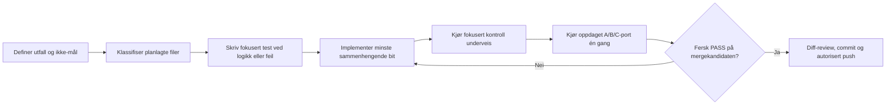

# Fra implementeringsplan til verifisert kode

## Formål

Dette dokumentet viser den faktiske arbeidsflyten i Flightglass og gjør det
mulig å måle om vi bruker mer tid på kontroll enn risikoen forsvarer.

Målet er ikke flest mulig grønne rapporter. Målet er én sterk kontroll per
reell feilmodus, med bredere kontroll når endringen faktisk øker risikoen.

## Arbeidsflyt



Før kode oppgis kort:

- ønsket observerbart utfall;
- eksplisitte ikke-mål;
- hvilke filer eller brukerflater som berøres;
- hvilken fersk evidens som betyr ferdig.

## Den implementerte A/B/C-porten

```powershell
# Forklar nivå og kontrollplan uten å kjøre noe
npm run verify:change -- --dry-run --file <planlagt-fil>

# Klassifiser den faktiske Git-diffen, kjør kontrollene og mål tiden
npm run verify:change

# Promoter frivillig til komplett current-main-kontroll
npm run verify:change -- --level C
```

| Nivå | Typisk endring | Kontroller |
|---|---|---|
| A – fokusert | Dokumentasjon eller den testede Home-flaten | Diff/secret/ID-kontroll; Home-kontrakt og Chromium-spot når runtime berøres |
| B – risikoutløst | Delt CSS/JS, annen shippingflate eller kontrollverktøy | A-kjerne, berørte ruter og WebKit; kontrollverktøy tester seg selv |
| C – komplett | Fysikk, betaling, native, dependency lock, CI eller release | Portkontrakt, Home, fire shippingruter i Chromium og WebKit, native copy |

Alle ikke-tørre kjøringer kontrollerer i tillegg:

- whitespace og merge-markører i tracked og utracket kildekode;
- mulige credentials i nye difflinjer og utracket kildekode;
- sju låste app-, butikk-, produkt- og storage-identifikatorer.

Genererte filer under `outputs/` påvirker ikke risikonivået. En manuell
nedgradering blir avvist uten eksplisitt tillatelse og en konkret begrunnelse.
Porten gjør ingen automatiske omkjøringer, så hvert nytt forsøk blir en egen
tidsmåling.

## Første main-måling

Den første nivå B-kjøringen 16. juli 2026 fant en reell verktøyfeil:
programmatisk oppstart av `npm.cmd` feilet med `EINVAL` på Windows. Kontrollene
ble derfor endret til å starte de samme Node-testene og `copy-web` direkte.

Den ferske kjøringen etter rettingen besto på 5,27 sekunder:

- 13/13 portkontrakter;
- sju beskyttede identifikatorer;
- diff- og secret-kontroll av tracked og utracket kildekode;
- to kompakte WebKit-caser med null kritiske funn.

Dette er et eksempel på ønsket kontrollutbytte: porten fant én konkret,
plattformspesifikk feil og krevde bare den browserflaten som kunne falsifisere
rettingen. Full produktmatrise ble ikke kjørt fordi ingen produktkode var
endret.

En supplerende Chromium-kjøring fant at harnessets egne vellykkede `HEAD`-
lenkeprober samtidig ble rapportert som avbrutte passive ressurskall. Kanalene
ble separert: lenkestatus vurderes av den aktive proben, mens ressurslytteren
ignorerer akkurat disse interne kallene. Etter rettingen besto 2/2 Chromium-
caser med null kritiske funn. Endringer i browser-harnessen kjører nå alltid
både Chromium og WebKit.

## Hvor kontrolltid vanligvis går tapt

| Tap | Mottiltak |
|---|---|
| Samme suite kjøres via flere toppkommandoer | Kontrollplanen dedupliserer kommando-ID-er |
| Full browsermatrise etter lokal dokumentasjonsendring | Dokumentasjon har ingen runtime-kontroll |
| Uklart om en kontroll fant en ny feil | Hver kontroll får eget resultat og varighet |
| Flaky test skjules av automatisk retry | Ingen automatisk retry i porten |
| Genererte screenshots blåser opp diff og klassifisering | `outputs/flightglass-gates/` er ignorert |
| Agent velger et lavere nivå for å spare tid | Stille nedgradering avvises |

## Måling for de neste tre endringene

Timingrapportene under `outputs/flightglass-gates/` bør brukes til å måle:

- **kontrollandel:** kontrolltid / samlet endringstid;
- **kontrollutbytte:** unike feil funnet / kontrolltime;
- **dupliseringsgrad:** bekreftende kontroller / alle kontroller;
- **flake-andel:** omkjøringer forårsaket av ustabil test / alle kjøringer;
- **ledetid:** første edit til verifisert mergekandidat.

En kontroll beholdes fast når den finner en alvorlig, unik feil. En kontroll som
over ti relevante endringer bare dupliserer en annen kontroll, bør flyttes ett
nivå ned. Når alle relevante kontroller er grønne på eksakt kandidat, stopper
løkken; en numerisk designscore alene utløser ikke mer arbeid.

## Begrensning

`verify:change` er et lokalt, kjørbart kvalitetsverktøy. Det er ikke i seg selv
GitHub branch protection eller et obligatorisk mergekrav. En slik påstand kan
først gjøres dersom en separat CI-jobb og repository-regel håndhever kommandoen.
