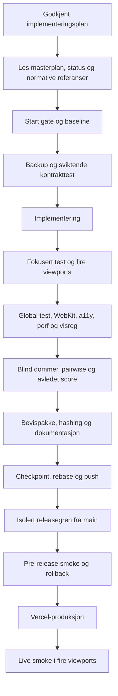
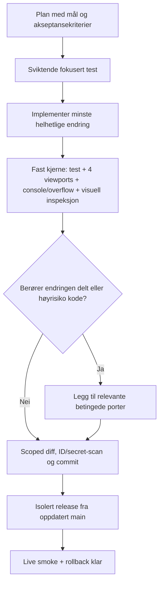

# Fra implementeringsplan til produksjon

## Formål

Dette dokumentet viser hvordan Flightglass-arbeid går fra godkjent plan til
kode, verifikasjon og produksjon. Det er laget som beslutningsgrunnlag for ett
spørsmål:

> Bruker vi mer tid på kontroll enn risikoen og kvalitetseffekten forsvarer?

Night Ladder-runden 15. juli 2026 er brukt som konkret eksempel. Det var en
uvanlig grundig showcase-runde og bør derfor ikke automatisk bli standard for
alle senere endringer.

## Kort konklusjon

Ja, dagens prosess har sannsynligvis for mye kontroll for en avgrenset
UI-endring. Kjernen er god, men flere kontroller måler nesten det samme, og noen
blir gjentatt etter at beslutningen allerede er tatt.

Kontrollene som faktisk fant unike feil i Night Ladder-runden bør beholdes:

- kontrakttest før og etter implementering;
- visuell kontroll i de fire faktiske skjermformatene;
- kollisjons-, overflow- og konsollkontroll;
- kontroll av transparent bilde-diff og stabil capture-timing;
- avgrenset releasegren fra `main`;
- live smoke-test og en kjent rollback.

Det største innsparingspotensialet ligger i å:

- ikke kjøre hele den globale testmatrisen for hver liten flateendring;
- ikke kjøre kommandoer separat når den overordnede kommandoen allerede
  inkluderer dem (`claude:ready` inkluderer brand + `test:ux`, og `test:ux`
  inkluderer WebKit);
- unngå flere parallelle bevispakker for samme layouttilstand;
- ikke bruke Academy-/Backspin-kontroller som obligatorisk Home-bevis når
  endringen ikke berører Academy;
- bruke blind sammenligning én gang ved designvalg, ikke på nytt ved mekanisk
  portering av det valgte designet;
- slutte å iterere når kvalitetsportene er grønne, uavhengig av om en avledet
  score kan presses enda høyere;
- holde store genererte `outputs/` utenfor arbeidsflyten for Git-stash og
  checkpoint;
- bruke full Phase 8-kontroll bare når endringen faktisk berører delt runtime,
  fysikk, native-pakke eller flere flater.

## Prosessen slik den fungerer i dag

| Trinn | Hovedaktivitet | Resultat | Typisk kontroll |
|---|---|---|---|
| 1. Plan | Lås mål, sannhet, flater og stoppvilkår | En implementerbar spesifikasjon | Plan-/spec-audit |
| 2. Readiness | Les styrende dokumenter og sjekk repo | Grønt startpunkt | `claude:ready`, status og manifest |
| 3. Baseline | Fang dagens oppførsel | Før-bilder og kjente funn | Fokusert UX-audit |
| 4. Kontrakt | Skriv testen som skal feile | Maskinlesbart mål | Rød TDD-test |
| 5. Koding | Gjør minste helhetlige endring | Ny fungerende flate | Løpende fokusert test |
| 6. Fokusert QA | Test bare endret flate | Funksjonell og visuell bekreftelse | Fire viewports, motion, a11y |
| 7. Global QA | Se etter regresjoner utenfor flaten | Systembekreftelse | Full suite, begge motorer, visreg, perf |
| 8. Vurdering | Uavhengig kvalitetsdom | PASS/FAIL og sammenligning | Manifestdommer og blind pairwise |
| 9. Evidens | Samle og hash bevis | Reproduserbar pakke | Indeks, hasher og avledet score |
| 10. Git | Sikre og dele arbeidet | Ren, sporbar commit | Diff, secret scan, rebase og push |
| 11. Release | Isoler bare det som skal ut | Produksjonsklar commit | Ren base fra `main`, rollback |
| 12. Live QA | Test faktisk URL | Bekreftet produksjon | HTTP, DOM, skjermbilder og ruter |

## Night Ladder: hva som faktisk ble kontrollert

Følgende er forskjellige kontrollaktiviteter, ikke bare forskjellige navn på
én test:

| Kontroll | Omfang i runden | Resultat |
|---|---:|---:|
| Fokusert Home-kontrakt | 4 tester | 4/4 bestått |
| Fokusert Home-audit | 4 viewports × 2 motion-moduser | 8/8 captures, ingen funn |
| Utvidet layoutmatrise | 2 motorer × 4 viewports × 3 tilstander | 24/24 bestått |
| axe-core | Samme 24 tilstander | 0 critical/serious |
| Tekst på 130 % | 8 tilstander | 8/8 intakte |
| Klikkmål/kollisjoner | 160 parvise kontroller | 0 overlapp, minst 8 px |
| Sifferstabilitet | 8 sykluser | 0 px breddeendring |
| Home → Impact | 2 motorer × 2 motion-moduser | 4/4 navigasjoner |
| Deterministiske Home-bilder | 16 par / 32 captures | maks 0,000 % diff |
| Full source/Chromium-suite | 87 tester, hvorav 4 er Home-kontrakten | 87/87 bestått |
| WebKit-suite | 41 tester fra Academy-/Backspin-suiten; ingen navngitt Home-test | 41/41 bestått |
| Input-to-paint | 220 events per motor på Academy lesson/Lab, ikke Home | p95 1,7/3,0 ms i oppsummeringen |
| Global visreg | 48 Academy-captures, ikke Home | bestått etter harness-fiks |
| Manifestdom | 17 krav; minst 10 er Academy-/lesson-spesifikke | 17/17 bestått |
| Blind pairwise | 2 sammenligninger | valgt design vant 2/2 |
| Avledet score | Én avledning | STUDIO-GRADE / 100 |
| Isolert release-test | 3 tester | 3/3 bestått |
| Pre-release live-format | 4 eksakte viewports | 0 feil/overflow |
| Produksjonskontroll | Home, 2 assets og 3 destinasjoner | HTTP 200 |
| Live visuell kontroll | 4 eksakte viewports | 0 feil/overflow |

De fire siste release-/live-resultatene er hentet fra sesjons- og
deploymentloggen. De er ikke lagret som egne, sporede testartefakter i
produksjonscommitten.

### Unike feil kontrollene fant

Den sporede evidensen beviser to unike harness-feil. Sesjonsloggen registrerer
i tillegg tre produkt-/releasefunn, men committen inneholder ikke et eget
før-bilde eller en sviktende artefakt for alle tre. Det skillet er viktig når vi
vurderer hvor reproduserbart kontrollutbyttet er.

1. **Feil i bilde-diff — dokumentert.** Visreg sammenlignet RGB, men ikke
   alpha. Transparente overganger kunne derfor bli underrapportert. Harnesset
   ble rettet.
2. **Ustabil capture-timing — dokumentert.** Lab-bilder ble tatt før riktig
   antall ghosts var klare. Ventebetingelsen ble gjort eksakt.
3. **Reelle målkollisjoner — registrert i sesjonen.** Outcome/Academy og
   Academy/help kolliderte i kompakt landscape. Det førte til en konkret
   layoutfiks, men den sporede sluttpakken viser bare null overlapp etterpå.
4. **Farlig releaseomfang — registrert i Git/releaseflyten.**
   Utviklingsgrenen lå 55 commits foran `main`. Kontroll før release hindret at
   Academy og annet WIP ble publisert sammen med Home.
5. **Manglende avhengigheter på `main` — registrert i releaseflyten.** De to
   Flightglass-SVG-filene fantes ikke på releasebasen. Den isolerte
   avhengighetskontrollen fanget dem før deploy.

Alle fem er unike risikofunn. En slankere prosess må fortsatt kunne finne dem,
men fremtidige før-/etter-funn bør lagres slik at effekten kan etterprøves.

## Hvor kontrollene overlapper

| Kontrollgruppe | Overlapp | Vurdering |
|---|---|---|
| Fokusert audit, 24-state layout og live fire-viewports | Måler alle synlighet, overflow og posisjon | Behold fire-viewports fast. Kjør 24-state bare ved responsive, motion- eller tekstendringer med høy risiko. |
| Determinisme og visreg | Begge sammenligner captures piksel for piksel | Bruk determinisme for animert/dynamisk rendering; bruk baseline-visreg for stabile flater. Ikke begge som standard. |
| Full Chromium-suite etter fokusert Home-test | Home-kontrakten kjøres igjen inne i global suite | Full suite bør utløses av endringsomfang, ikke av at en fil heter `index.html`. |
| `claude:ready`, `test:ux`, WebKit og brand kjørt separat | `claude:ready` kjører brand + `test:ux`; `test:ux` kjører WebKit | Bruk én toppkommando ved milepæl. Kjør bare underkommandoen ved fokusert feilsøking. |
| Manifestdom, pairwise og eierens designvalg | Tre metoder bekrefter delvis samme visuelle beslutning | Bruk manifestdom for krav og pairwise for designvalg. Ikke gjenta pairwise når valgt design bare portes mekanisk. |
| Home-godkjenning med Academy-bevis | Perf og global visreg er Academy-orienterte; 41 tester kommer fra Academy-/Backspin-suiten uten en navngitt Home-test; minst 10/17 dommerkrav er lesson-spesifikke | Ikke regn en grønn kontroll som Home-sikkerhet uten at input og flate faktisk dekker Home-risikoen. |
| Baseline, verify og ekstra egen harness | Samme viewports kan bli fanget tre ganger | Én capture bør kunne brukes av flere kontroller når provenance er tydelig. |
| Lokal backup, Git-branch og Vercel-rollback | Tre rollback-mekanismer | Git + Vercel er normalt nok for sporede filer. Lokal backup trengs ved ucommittede binærfiler, migrering eller destruktiv transformasjon. |
| Secret scan og diff-check ved flere checkpoints | Samme avgrensede diff kontrolleres gjentatte ganger | Kjør før ekstern push og release. Mellomliggende repetisjon bare hvis diffen har endret seg. |
| Evidensindeks med 133 kontrollerte artefakter | Sikrer integritet i en stor evalpakke | Behold ved milepæl/baseline. For en liten UI-patch er commit-SHA og navngitte rapporter vanligvis nok. |

## Målbar friksjon fra denne runden

Dette er bare tider som ble observert direkte i sesjonen. De er ikke et komplett
tidsregnskap:

| Aktivitet | Observert ventetid | Type |
|---|---:|---|
| Stash av store lokale `outputs/` før rebase | 100,1 s | Prosess-/repo-friksjon |
| Ny stash av samme råmateriale etter rebase | 119,9 s | Gjentatt prosessfriksjon |
| Feil målrettet testkommando som endte i timeout | 124 s | Verktøy-/kommandoavvik |
| Første Chrome-fallback før eksakt CDP-capture | 21,4 s | Unødvendig mellomsteg |
| Eksakt CDP-capture | 11,5 s | Nyttig kontroll |
| Vercel produksjonsdeploy | 29,3 s | Nødvendig releasearbeid |
| Perf-test | 6,49 s | Academy lesson/Lab, ikke Home |
| Post-fix global visreg | 91,44 s | 48 Academy-captures, ikke Home |
| WebKit-suite | 125,79 s | 41 Academy-/Backspin-tester, ingen navngitt Home-test |

De første seks sesjonspostene summerer seg til omtrent 6 minutter og 46
sekunder. De tre testloggene legger til 3 minutter og 44 sekunder. Omtrent 10
minutter og 29 sekunder er dermed direkte dokumentert, uten at hoveddelen av
Home-audit, layoutmatrise, determinisme, dommer eller hashing har registrert
varighet. Omtrent 3 minutter og 44 sekunder av den målte testtiden var på
Academy-/Backspin-flater, ikke på Home. Dette viser både verktøyfriksjon og
kontroll med svak kobling til endringens faktiske risiko.

## Er den store evidenspakken mer pålitelig?

Ikke entydig. Faktasjekken fant tre konsistensproblemer:

1. Dommeren refererer til `artifact-index.json`, 32 determinismebilder, 12
   proof-bilder og 48 aktuelle visreg-bilder som ikke er sporet i committen. En
   fersk clone har oppsummeringer og hasher, men ikke hele rågrunnlaget.
2. Den konsoliderte oppsummeringen oppgir perf p95 1,7/3,0 ms, mens de sporede
   rårapportene i committen oppgir 3,2/5,0 ms og ikke matcher oppsummeringens
   hasher. Begge resultater er godt under budsjettet, men det eksakte tallet kan
   ikke reproduseres fra committen alene.
3. STATUS beskriver Home som STUDIO-GRADE / 100 øverst, mens samme fils nederste
   indikatorledger fortsatt viser Home = 67.

Konsekvensen er viktig: flere artefakter gir ikke automatisk bedre kontroll.
En mindre pakke med rådata som faktisk er sporet, én sann kilde og få avledede
rapporter kan være både raskere og mer etterprøvbar.

## Foreslått slank prosess

### Nivå A – alltid for enhver shipping-endring

1. Tydelig plan med berørte filer og akseptansekriterier.
2. Minst én test som feiler før koding og består etterpå.
3. Fire mål-viewports i primær browser.
4. Konsollfeil, page errors, overflow og faktiske lenker/handlinger.
5. Én menneskelig visuell inspeksjon av de samme bildene.
6. Scoped diff, beskyttede ID-er og secret scan før push.
7. Ren releasebase, kjent rollback og live smoke etter deploy.

### Nivå B – bare når endringen utløser risikoen

| Trigger | Ekstra kontroll |
|---|---|
| CSS/layout, browser-API eller navigasjon | WebKit spot-check i én kompakt portrait og én landscape |
| Semantikk, skjema eller nye controls | Fokusert axe-core og keyboard/screen-reader-kontrakt |
| Input, Canvas eller animasjon | Perf-test og determinismetest |
| Godkjent visuell baseline | Visreg mot baseline |
| Delt CSS, storage, nav eller host | Berørte flater + global suite |
| Fysikk eller beregning | Frosne numeriske fixtures og eksplisitt autorisasjon |
| Native-pakke | `copy-web`, root/`www`-paritet og native smoke |
| Ny visuell retning | Blind pairwise én gang før designet låses |

### Nivå C – milepæl eller full release

- komplett to-motorers matrise;
- alle flater og motion-moduser;
- full perf-/a11y-/visreg-pakke;
- uavhengig manifestdom;
- evidensindeks og hashintegritet;
- store native/store-reviewer-porter.

Nivå C bør ikke arves av hver liten patch bare fordi det finnes en global
releaseplan.

## Forslag til kontrollbudsjett per endringstype

| Endringstype | Standardbudsjett |
|---|---|
| Tekst eller lokal styling | Nivå A, men bare relevante kontrakter og viewports |
| Én hel UI-flate | Nivå A + relevante Nivå B-triggere |
| Delt komponent eller delt CSS | Nivå A + global regresjon for berørte flater |
| Canvas, animasjon eller inputmodell | Nivå A + perf + determinisme + motor-spot |
| Fysikk/storage/native | Nivå A + alle relevante Nivå B-porter |
| Milepæl/produksjonskandidat | Nivå A + B + C |

## Hva vi bør måle de neste tre endringene

Dagens evidens er god på kvalitet, men svak på tidsbruk. For de neste tre
flateendringene bør hver aktivitet logges med start/slutt og én av disse kodene:

| Kode | Betydning |
|---|---|
| PLAN | Plan og avklaringer |
| CODE | Implementering |
| FIX | Feilretting etter et reelt funn |
| CHECK-UNIQUE | Kontroll som finner en ny feil |
| CHECK-CONFIRM | Kontroll som bare bekrefter tidligere resultat |
| RERUN-FLAKE | Omløp på grunn av ustabil test/harness |
| TOOL-WAIT | Installering, stash, capture-oppsett eller annen venting |
| RELEASE | Branch, deploy og live smoke |

Deretter beregnes:

- **kontrollandel** = kontrolltid / total tid;
- **kontrollutbytte** = unike feil funnet / kontrolltime;
- **dupliseringsgrad** = bekreftende kontroller / alle kontroller;
- **flake-andel** = flake-omløp / alle testkjøringer;
- **ledetid** = fra første kodeendring til verifisert produksjon.

## Beslutningsregler etter måleperioden

1. En kontroll som finner en alvorlig unik feil beholdes fast eller som tydelig
   triggerbasert port.
2. En kontroll som ikke har funnet en unik feil i ti relevante endringer, og
   overlapper sterkt med en annen kontroll, flyttes ett nivå ned.
3. En flaky kontroll repareres som verktøyfeil. Gjentatte omløp skal ikke telles
   som høyere produktkvalitet.
4. Når null kritiske feil, kategorigulv, kritiske krav og nødvendig pairwise er
   grønne, stopper kvalitetsløkken. En numerisk score alene utløser ikke mer
   arbeid.
5. Dersom kontrolltid konsekvent er større enn kode- og rettetid samlet for en
   lavrisikoendring, må kontrollsettet begrunnes på nytt.

## Anbefalt eksperiment

Bruk den slanke prosessen på de neste tre avgrensede UI-flatene, men behold
dagens prosess som referanse på én sammenlignbar flate. Sammenlign:

- kritiske feil etter release;
- unike feil funnet før release;
- kontrollandel og ledetid;
- antall testomløp og genererte artefakter.

Hvis den slanke prosessen gir samme feilrate og visuelle kvalitet med lavere
kontrollandel, bør Nivå A/B/C-modellen erstatte dagens «alt hver gang»-tolkning.

## Anbefaling nå

Innfør Nivå A/B/C-modellen umiddelbart for nye UI-endringer. Behold den fulle
Flightglass-pakken for milepæler, fysikk, native og delte systemendringer. For
vanlige flateendringer bør målet være **én sterk kontroll per reell risiko**,
ikke flest mulig grønne rapporter.

## Kildegrunnlag

Prosesskravene og tallene i dokumentet er hentet fra:

- `CLAUDE.md` og `AGENTS.md`;
- `package.json`;
- `docs/flightglass-autopilot/STATUS.md`;
- `outputs/flightglass-home-night-ladder-eval/consolidated-machine-proof.json`;
- `outputs/flightglass-home-night-ladder-eval/machine-checks.json`;
- `outputs/flightglass-home-night-ladder-eval/home-determinism-results.json`;
- `outputs/flightglass-home-night-ladder-eval/judge-home-v1.json`;
- `outputs/flightglass-home-night-ladder-eval/pairwise-result-v1.json`;
- `outputs/flightglass-home-night-ladder-eval/derived-home-v1.json`;
- `outputs/flightglass-home-night-ladder-eval/test-perf.log`;
- `outputs/flightglass-home-night-ladder-eval/test-visreg-post-fix.log`;
- `outputs/flightglass-home-night-ladder-eval/test-webkit.log`;
- Git-objektene for implementeringscommit `2978756` og produksjonscommit
  `de45f0e`;
- målte kommando-/ventetider fra den aktive Night Ladder-sesjonen.
