# Flightglass Academy — module description and visual catalog

Generated from `agent/academy-codex` on 2026-07-17. This document describes the
canonical Academy module as it exists in source. It is an analysis aid, not a
release-acceptance claim.

## What Academy is

Academy is Flightglass's guided golf-physics curriculum. Its job is not to give
generic swing advice. It teaches one modeled relationship at a time by letting
the learner manipulate a visible instrument, read the engine-backed outcome,
test a misconception and prove transfer in a new state.

The implemented curriculum contains:

- 13 core experiences and one optional Plane Coupling model lab;
- six surfaces per experience and 85 canonical screens including Academy Home;
- 24 legacy physics concepts, each owned by exactly one experience;
- six families: Direction, Strike, Flight, Distance, Conditions and Model Labs;
- four goal-led journeys on Home;
- 120 XP awarded once per mastered core experience;
- 102 local, caption-matched Voice cues with no runtime provider dependency.

Academy is source-complete and testable, but it is not fully release-accepted.
The new modules still need their own provenance-blind visual comparisons. Native
iOS/Android projects, physical-device audio behavior, iOS VoiceOver and the
continuous fatigue listen also remain open.

## Learning loop

Each canonical route follows `#/experience/{id}/surface/{0..5}`. The shared
anatomy is:

1. Mission — establish the observable job.
2. Lab or instrument — manipulate one dominant model.
3. Influence — separate direct, mediated and held variables.
4. Boundary or myths — state what the model does not prove.
5. Mastery — require 4/5 knowledge plus a live transfer task.
6. Result — record practiced/mastered evidence and the next action.

The 24 older `#/lesson/{concept}` addresses remain compatibility aliases. The
router resolves each alias to its owning experience; the protected
`strikearc.academy.v1` storage key is not migrated or renamed.

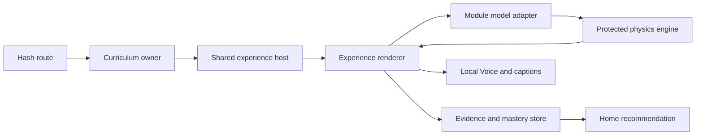

## Code architecture

The canonical runtime consists of 72 files: `academy.html`, 55 JavaScript files
and 16 CSS files. The all-source analysis snapshot additionally includes the
direct physics/geometry/haptics dependencies, Voice and surface configuration,
package commands, every Academy test/tool file and the strict Voice verifier.

| Layer | Main files | Responsibility |
|---|---|---|
| Shell and composition | `academy.html` | Hash navigation, renderer registry, legacy content and app-level orchestration |
| Curriculum and routing | `academy-curriculum.js`, `academy-router.js`, `academy-journey-router.js` | Ownership, prerequisites, canonical/legacy routing and next action |
| Persistence | `academy-store.js`, `academy-lesson-journey.js` | Additive migration, progress, evidence, one-time XP and Voice preference |
| Shared runtime | `academy-experience-host.js`, `academy-readout-format.js`, `academy-trace-state.js` | Renderer lifecycle, truth formatting and trace history |
| Voice | `academy-voice*.js`, `config/academy-voice-pack.json` | Consent, local playback, captions, semantic targets and 102-asset manifest |
| Experience slices | `academy-*-content.js`, `academy-*-model.js`, `academy-*-experience.js`, matching CSS | Copy/contract, protected-engine adapter, interaction and presentation |
| Backspin reference | `academy-native-lesson.js`, `academy-native-lesson.css`, `academy-backspin-model.js` | Original STUDIO-GRADE six-surface native shell |
| Verification | `scripts/academy-*.test.mjs`, `scripts/verify-academy-voice-pack.mjs` | Model fixtures, browser journeys, accessibility contracts, Voice and shipping integrity |

The main analysis hotspot is `academy.html` at roughly 716 KB. It still combines
the app shell, 24 long-form legacy content blocks, routing orchestration and the
older generic lesson renderer. Backspin is another large, distinct renderer in
`academy-native-lesson.js`. Newer experiences are more modular, but several are
stored as heavily compacted one-line JavaScript, which makes human diffs and
static review harder than their file boundaries suggest.

## Curriculum

| Family | Experience | ID | Prerequisites | Type |
|---|---|---|---|---|
| Direction | Start Line | `start-line` | — | Core |
| Direction | Shape | `shape` | Start Line | Core |
| Direction | Carry Side | `shot-pattern` | Start Line, Shape | Core |
| Strike | Up or Down at Impact | `attack-at-impact` | — | Core |
| Strike | Low Point | `low-point` | Up or Down at Impact | Core |
| Strike | Contact Height | `strike-depth` | Low Point | Core |
| Flight | Delivered Loft & Launch | `delivered-loft-launch` | Up or Down at Impact | Core |
| Flight | Backspin | `backspin` | Delivered Loft & Launch, Up or Down at Impact | Core |
| Flight | Flight Height & Descent | `flight-height-descent` | Delivered Loft & Launch, Backspin | Core |
| Distance | Speed Transfer | `speed-transfer` | — | Core |
| Distance | Carry | `carry` | Speed Transfer | Core |
| Conditions | Air Density | `air-density` | Carry | Core |
| Conditions | Wind | `wind` | Carry, Carry Side | Core |
| Model Labs | Plane Coupling | `plane-coupling-lab` | Low Point, Contact Height | Optional, no XP |

## Analysis files

Run this command from the repository root to regenerate the complete package:

```powershell
node scripts/build-academy-analysis-pack.mjs
```

It creates two ignored local files so the repository does not commit a large,
duplicated generated bundle:

- `outputs/academy-analysis/FLIGHTGLASS-ACADEMY-ANALYSIS.html` — one
  self-contained browser file with this description, every contact sheet and
  all source code in searchable, collapsible sections;
- `outputs/academy-analysis/ACADEMY-SOURCE-SNAPSHOT.txt` — a model-friendly
  plain-text snapshot with a file index, SHA-256 hashes and exact file markers.

The snapshot contains 139 text files (about 2.3 MB): all 72 canonical runtime
files, five direct dependencies, three support/configuration files and 59
Academy tests or tools.

Full-size screenshots and their route/hash manifest are stored below the same
output folder. The curated contact sheets embedded below are tracked so the
visual catalog also works on GitHub.

## Screenshot method and limits

The catalog uses Chromium at 430×932, device scale 1, reduced motion and Voice
off. It contains 86 full-size viewport captures: two Home states plus all 84
experience surfaces, assembled into 15 contact sheets. All prerequisites are
seeded as mastered so every surface is directly reviewable. Academy Home is
shown both as a new learner and with full progress. Result pages receive a
deterministic, coherent 5/5 analysis fixture; these are synthetic review states,
not learner records. Each surface screenshot is its representative initial
viewport; alternate slider, quiz, failure, retry and accessibility states live
in the included browser tests rather than being multiplied into this catalog.

The 24 legacy concept routes are not separate screenshots because they are
aliases into these same 14 renderers.

## Academy Home

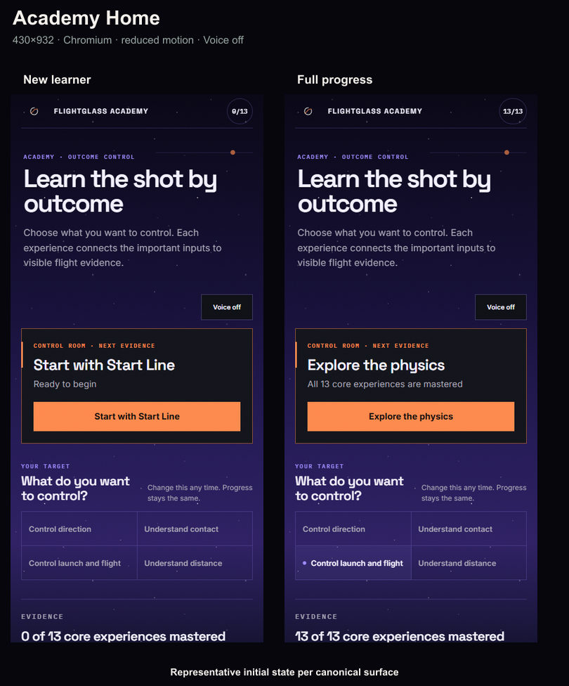

## Direction

### Start Line

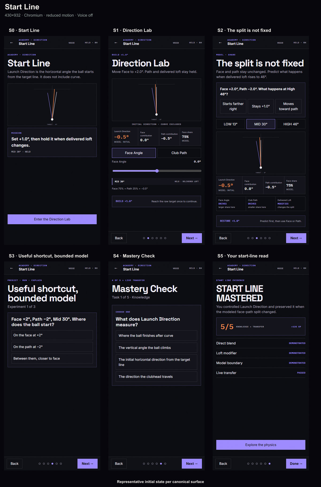

### Shape

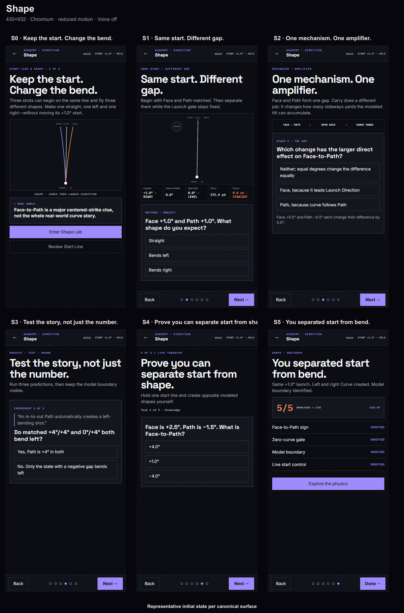

### Carry Side

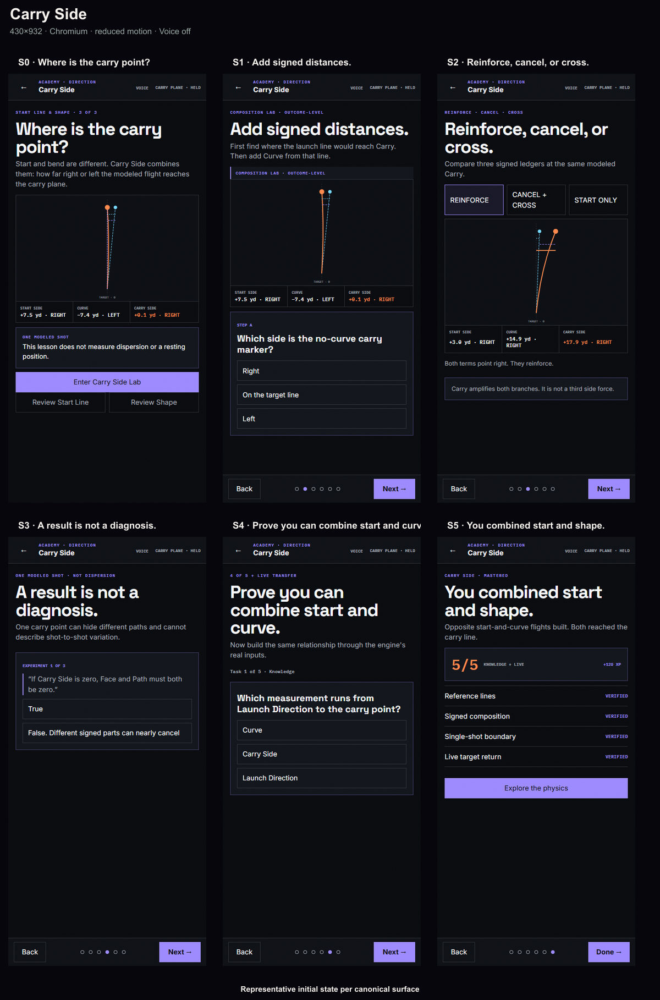

## Strike

### Up or Down at Impact

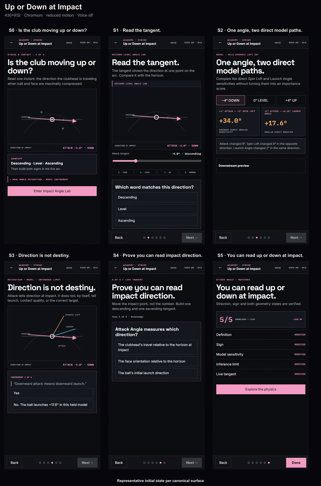

### Low Point

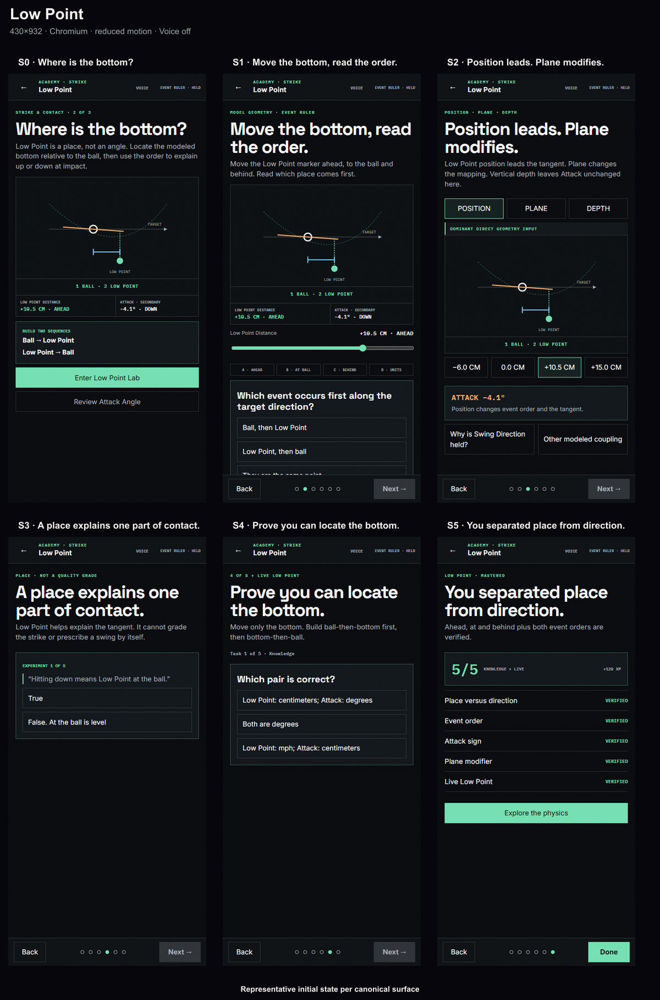

### Contact Height

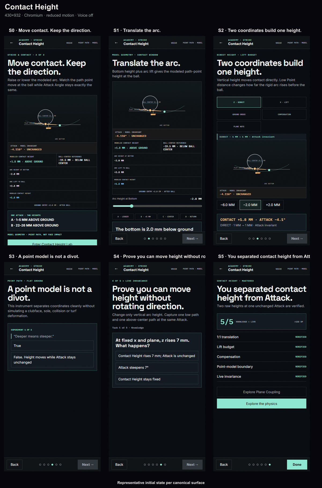

## Flight

### Delivered Loft & Launch

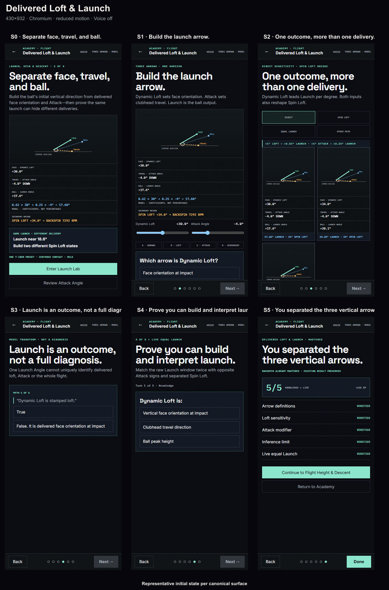

### Backspin

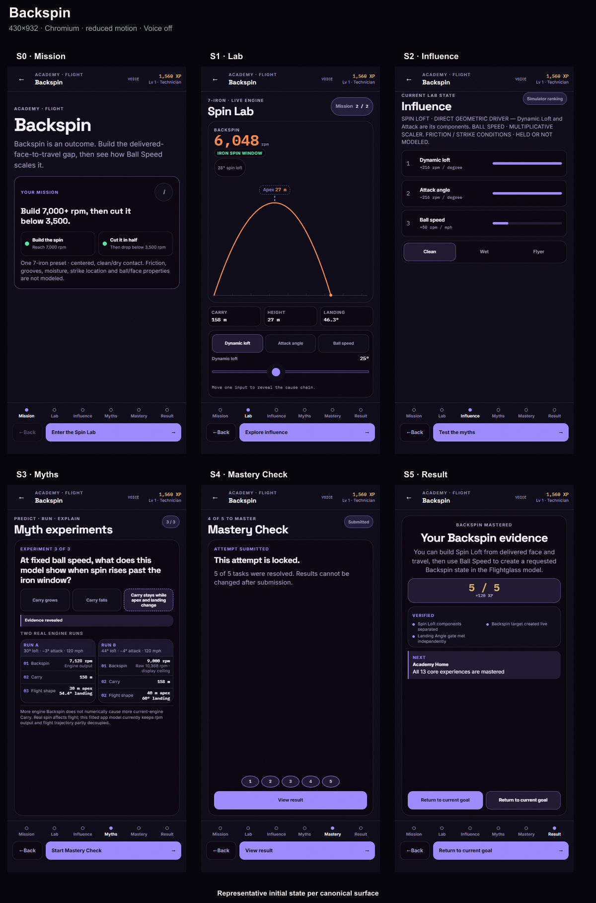

### Flight Height & Descent

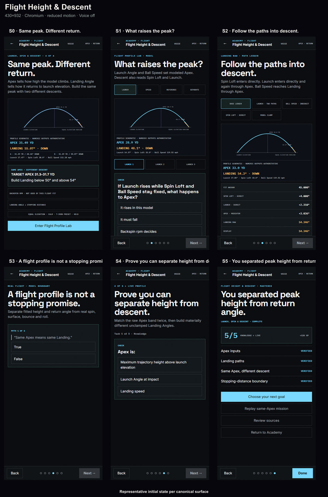

## Distance

### Speed Transfer

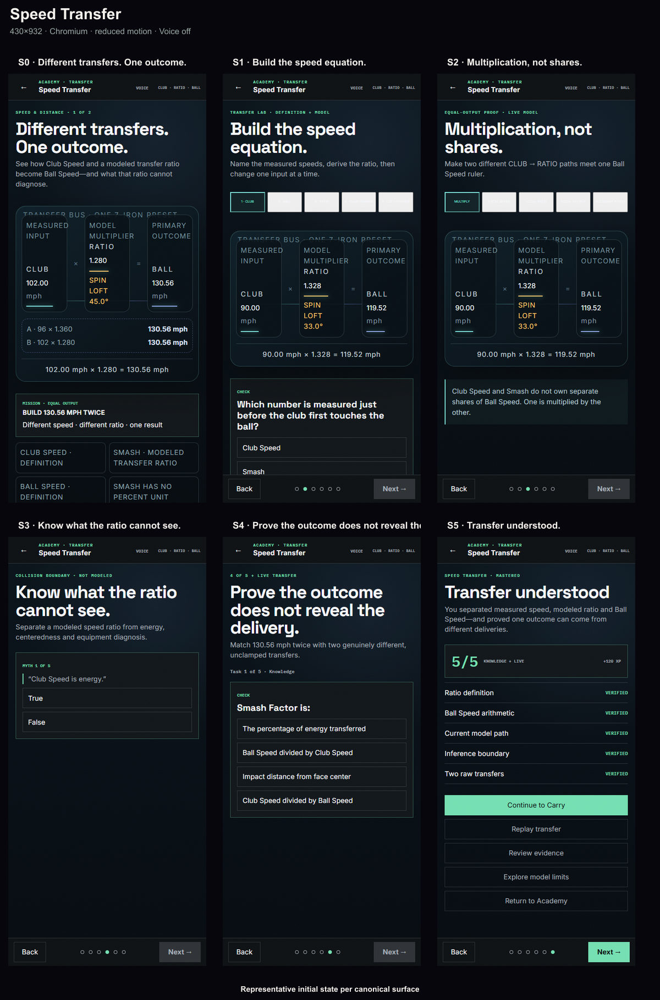

### Carry

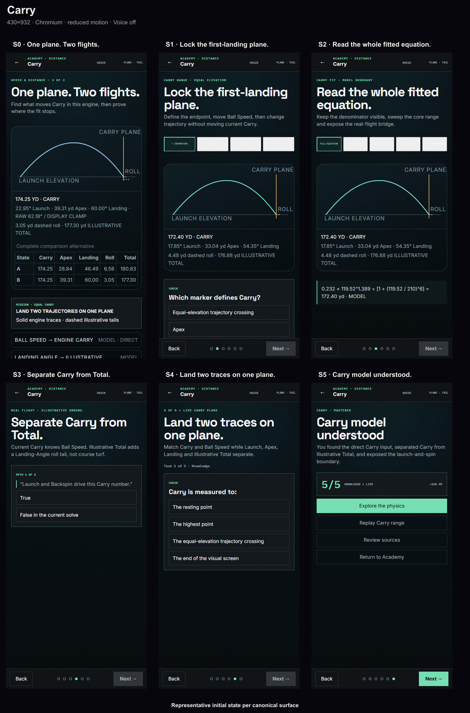

## Conditions

### Air Density

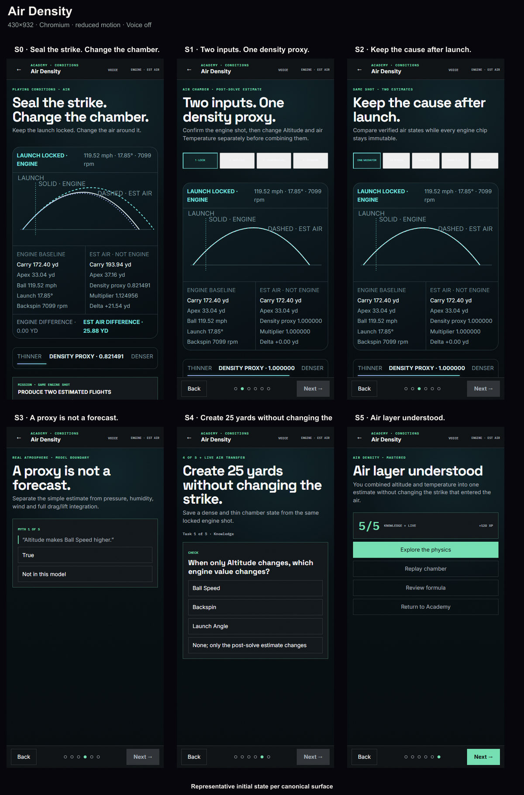

### Wind

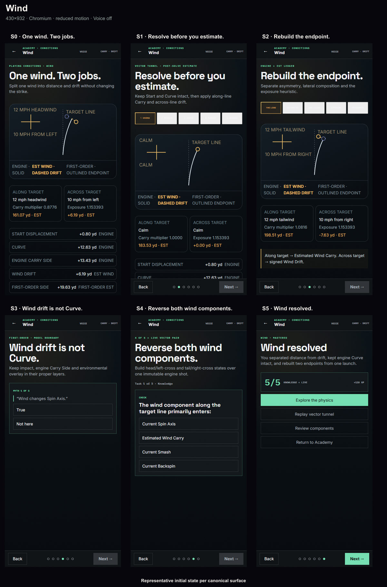

## Optional Model Lab

### Plane Coupling

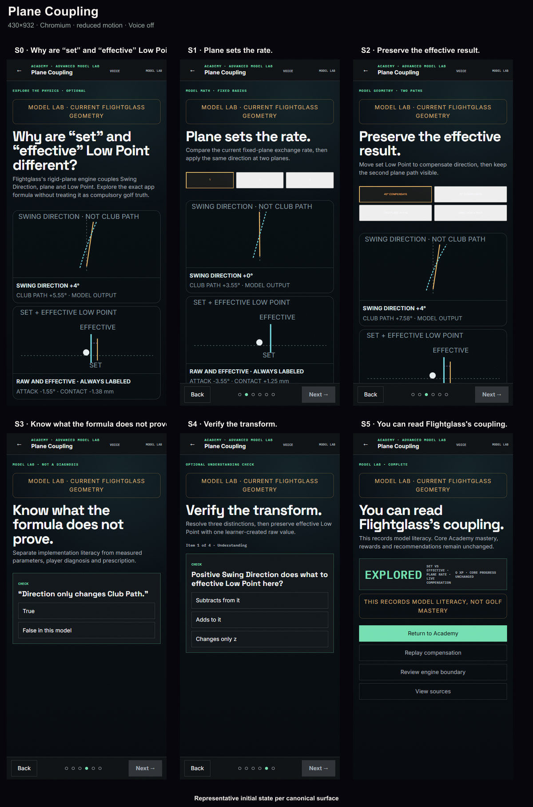

## Verification note

The same runtime previously passed the complete 500/500 control gate. The
fresh documentation-run startgate on 2026-07-17 reached the one-hour shell
limit while it was still progressing through sequential WebKit. It produced no
assertion failure and changed no tracked file, so it is recorded as
inconclusive rather than green. The analysis generator has its own count, hash,
image-dimension, entropy and self-containment checks.
